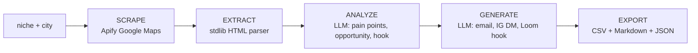

<div align="center">

# Sarah AI

**One command turns a niche plus a city into a qualified, researched, ready-to-send outreach list.**

[![License][license-badge]][license-link]
[![Python][python-badge]][python-link]
[![No dependencies][deps-badge]][deps-link]

[Source](.) · [Author portfolio](https://msstrategies.github.io)

</div>

## The problem

Most repetitive Virtual Assistant work is a fixed pattern: pull a list of businesses, read each website, draft a tailored message, repeat. Done by hand it is slow, inconsistent, and expensive. Handed to an open-ended AI agent it gets unreliable, because error compounds across every free decision the model makes.

## What it does

Sarah AI is a deterministic lead-ops pipeline. You give it a business niche and a city. It scrapes local businesses from Google Maps, reads each website, finds the gap, and writes a tailored cold email, Instagram DM, and Loom hook for every lead. It then writes a CSV, a readable markdown report, and raw JSON to `outputs/sarah-ai/`.

An LLM is invoked at exactly two steps, analyze and generate. Everything else is plain standard-library Python. When no API key is present, the pipeline still completes end to end on mock data and marks the model steps with a visible `[AI unavailable - no API key]` sentinel instead of crashing.

```text
$ python3 sarah_ai.py --demo

  Demo Mode - using mock data

  SARAH AI - Lead Generation Pipeline
  Niche:    Coiffeur
  Location: Bern
  Max:      2
  AI:       ON

  SCRAPING: 'Coiffeur' in Bern
  APIFY_API_KEY not set - using demo data

  AI ANALYSIS + OUTREACH GENERATION
  [1/2] Demo Coiffeur 1
  Analyzing: Demo Coiffeur 1... ok
  Generating outreach... ok
  [2/2] Demo Coiffeur 2
  Analyzing: Demo Coiffeur 2... ok
  Generating outreach... ok

  RESULTS
  Total Leads:  2
  Report:       outputs/sarah-ai/coiffeur_bern_<timestamp>.md
  CSV:          outputs/sarah-ai/coiffeur_bern_<timestamp>.csv
  JSON:         outputs/sarah-ai/coiffeur_bern_<timestamp>.json
```

## How it works



`SCRAPE`, `EXTRACT`, and `EXPORT` are deterministic, testable functions with no LLM involvement. `ANALYZE` and `GENERATE` are the only two stages that call a model. The structure of the run never changes; only the text inside those two boxes does.

## Run it

```bash
git clone https://github.com/msstrategies/sarah-ai.git
cd sarah-ai

# see the full pipeline on mock data, no API keys needed
python3 sarah_ai.py --demo
```

No `pip install` step. The pipeline uses only the Python standard library and runs on Python 3.8 or newer.

To run for real, add credentials and call it with a niche and a city:

```bash
cp .env.example .env    # then fill in APIFY_API_KEY and one LLM key

# full pipeline: scrape, analyze, generate outreach, export
python3 sarah_ai.py "Coiffeur" "Bern"

# cap the number of leads (default 25)
python3 sarah_ai.py "Restaurant" "Zurich" --max 10

# scrape and export only, skip both LLM steps
python3 sarah_ai.py "Maler" "Bern" --skip-ai

# deep-research a single website
python3 sarah_ai.py --research "https://example.com"
```

| Flag | Effect |
| :--- | :--- |
| `--max N` | Limit leads scraped (default 25) |
| `--skip-ai` | Run scrape and export only, skip both LLM steps |
| `--research URL` | Analyze one website in depth, skip the list pipeline |
| `--demo` | Run the whole flow on mock leads, no API keys needed |

## Design notes

- **Deterministic over autonomous.** Every step is gated, logged, and reproducible. The LLM analyzes and writes; it never decides the control flow. A fixed pipeline with two narrow model calls is more reliable than an open-ended agent that compounds error across many free choices.

- **Tool boundaries.** Each capability is a discrete function with a clear contract: `scrape_leads`, `research_website`, `analyze_company`, `generate_outreach`, `fetch_page_text`. You can call, test, or swap any one in isolation. That is the same boundary discipline a clean MCP server needs, which is the production target.

- **One LLM seam.** Every model call goes through a single `ai_call` function with a cost cascade: OpenRouter (`anthropic/claude-3.5-haiku`) first for the cheapest route, Anthropic direct (`claude-3-5-haiku-20241022`) as a fallback, then a clear sentinel string if neither key is set. Swapping the model, provider, or prompt is a one-function change.

- **Stdlib-first.** No third-party runtime dependencies. HTTP is `urllib`, HTML parsing is `html.parser`, output is `csv` and `json`. Fewer dependencies means a smaller supply-chain surface, no install step, and nothing to break on a fresh machine.

- **Secrets stay out of the repo.** Keys load from `.env` via `os.environ.setdefault`, so a real shell environment always wins. `.env` is gitignored, the repo ships `.env.example`, and no key is ever printed.

This is a working prototype, not a finished SaaS. The scraper polls Apify with a fixed timeout, error paths fall back to demo data, and the LLM steps are intentionally narrow. It is a proof-of-concept for a production direction: turning this pipeline into a deterministic MCP server that plugs into a customer's own stack, so the same repetitive labor disappears from inside the tools they already use.

## License & author

MIT. See [`LICENSE`](LICENSE).

Built by Michael Sezer. [Portfolio](https://msstrategies.github.io) · [GitHub](https://github.com/msstrategies)

[license-badge]: https://img.shields.io/badge/License-MIT-5fc2b8?style=flat-square
[license-link]: https://opensource.org/licenses/MIT
[python-badge]: https://img.shields.io/badge/Python-3.8%2B-5fc2b8?style=flat-square
[python-link]: https://www.python.org/
[deps-badge]: https://img.shields.io/badge/dependencies-none-3fb98f?style=flat-square
[deps-link]: #design-notes
