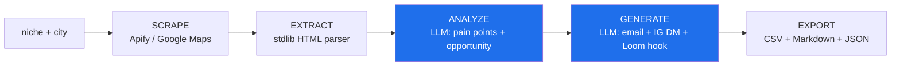

# Sarah AI

**One command turns a niche plus a city into a qualified, researched, ready-to-send outreach list.**

[](https://opensource.org/licenses/MIT)
[](https://www.python.org/)
[](#status)
[](#design-principles)

Sarah AI is a deterministic lead-ops pipeline. You give it a business niche and a city. It scrapes local businesses, reads each website, finds the gap, and writes a tailored outreach message for every lead. Then it hands you a CSV and a readable markdown report.

The point is not "an AI agent that does sales for you." The point is the opposite. Sarah is a fixed, gated, reproducible pipeline where an LLM is invoked at exactly two steps (analyze, generate) and nowhere else. The structure stays deterministic. The judgment lives in a box.

---

## Why this matters

Most repetitive Virtual Assistant work is a fixed pattern: pull a list, look something up, draft a message, repeat. A deterministic pipeline runs that pattern faster, more cheaply, and more reliably than a human, with an LLM only at the steps that genuinely need judgment.

Sarah is the proof-of-concept behind a larger thesis: deterministic AI replacing repetitive VA tasks by integrating deeply (via MCP) into a customer's own software, instead of bolting a chatbot on top. Same labor, removed. No "agent went rogue," no 60-percent reliability cliff that comes from letting a model freelance across 8 steps. The pipeline is the spine. The model is a tool the pipeline calls.

---

## Architecture



The two blue nodes are the only places an LLM runs. Everything else is plain, testable Python.

ASCII fallback for environments without Mermaid:

```text
  niche + city
       |
       v
 [ SCRAPE ]   Apify Google Maps actor  (deterministic, polled, demo-fallback)
       |
       v
 [ EXTRACT ]  stdlib HTMLParser, strips script/style, caps text  (no deps)
       |
       v
 [ ANALYZE ]  LLM  ->  pain points, opportunity, hook, priority   <-- judgment
       |
       v
 [ GENERATE ] LLM  ->  cold email, IG DM, Loom hook                <-- judgment
       |
       v
 [ EXPORT ]   CSV  +  Markdown report  +  raw JSON
```

---

## Quickstart

```bash
git clone https://github.com/msstrategies/sarah-ai.git
cd sarah-ai

# see the full pipeline on mock data (no API keys needed)
python3 sarah_ai.py --demo
```

`--demo` runs the full pipeline on mock data so you can see the output shape before adding any credentials.

To run for real, add keys:

```bash
cp .env.example .env    # then fill in the values
python3 sarah_ai.py --demo   # confirm it still runs
```

Needs Python 3.8 or newer. No `pip install` step. The pipeline uses only the standard library.

---

## Usage

```bash
# full pipeline: scrape, analyze, generate outreach, export
python3 sarah_ai.py "Coiffeur" "Bern"

# cap the number of leads
python3 sarah_ai.py "Restaurant" "Zurich" --max 10

# scrape only, no LLM calls (fast, free, list-only)
python3 sarah_ai.py "Maler" "Bern" --skip-ai

# deep-research a single website
python3 sarah_ai.py --research "https://example.com"

# offline demo on mock data
python3 sarah_ai.py --demo
```

| Flag | Effect |
| :--- | :--- |
| `--max N` | Limit leads scraped (default 25) |
| `--skip-ai` | Run scrape and export only, skip both LLM steps |
| `--research URL` | Analyze one website in depth, skip the list pipeline |
| `--demo` | Run the whole flow on mock leads; no API keys needed (the LLM steps show the [AI unavailable] sentinel) |

### Output

Every run writes three artifacts to `outputs/sarah-ai/`, timestamped:

- `*.csv` - the lead list (UTF-8, headered), ready for a CRM import
- `*.md` - a readable report: per-lead analysis plus ready-to-send outreach
- `*.json` - the raw structured data for downstream tooling

---

## Design principles

- **Deterministic over autonomous.** Every step is gated, logged, and reproducible. The LLM analyzes and writes. It never decides the control flow. This is the whole bet: a fixed pipeline with two narrow model calls beats an open-ended agent that compounds error across many free choices.

- **Tool boundaries.** Each capability is a discrete, testable function with a clear contract: `scrape_leads`, `research_website`, `analyze_company`, `generate_outreach`, `fetch_page_text`. You can call, test, or swap any one in isolation. This is the same boundary discipline that makes a clean MCP server, which is the production target.

- **Environment hygiene.** Secrets come from `.env`, never hardcoded, loaded with `os.environ.setdefault` so a real shell environment always wins. `.env` is gitignored; the repo ships `.env.example`. No key is ever printed.

- **`--demo` as a first-class mode.** The pipeline runs on mock data with no API keys needed. New contributors and reviewers see the exact output shape in one command, and every missing-key or failed-call path degrades gracefully to the sentinel or demo data instead of crashing.

- **Stdlib-first.** No third-party runtime dependencies. HTTP is `urllib`, HTML parsing is `html.parser`, output is `csv` and `json`. Fewer dependencies means a smaller supply-chain surface, no install step, and nothing to break on a fresh machine.

---

## How the LLM layer is wired

The model call is abstracted behind one function, `ai_call`, with a deliberate cost cascade:

1. **OpenRouter** (`anthropic/claude-3.5-haiku`) first, for the cheapest route.
2. **Anthropic direct** (`claude-3-5-haiku-20241022`) as a fallback if OpenRouter is absent.
3. A clear `[AI unavailable - no API key]` sentinel if neither key is set, so the pipeline still completes and the gap is visible in the output rather than hidden in a crash.

Swapping the model, the provider, or the prompt is a one-function change. The rest of the pipeline does not know or care which model answered.

---

## Status

**Working prototype.** It runs, it ships real output, and it is honest about its edges: the scraper polls Apify with a fixed timeout, error paths fall back to demo data, and the LLM steps are intentionally narrow. It is a proof-of-concept for a production direction, not a finished SaaS.

The production version turns this pipeline into a deterministic MCP server that plugs directly into a customer's own stack, so the same labor disappears from inside the tools they already use.

---

## License

MIT. See `LICENSE`.

Built by Michael Sezer (MSStrategies).
